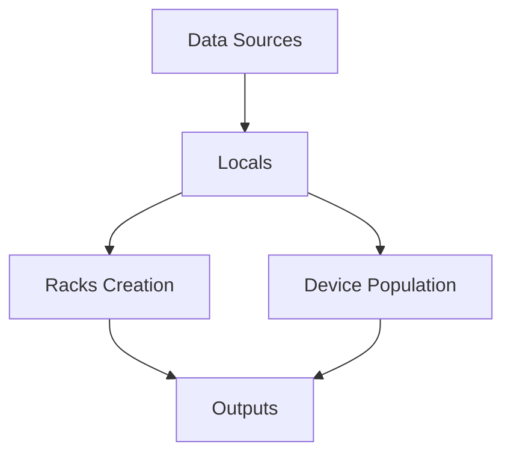

# Racks Globais - Netbox Terraform

Este diretório contém a configuração para criação e população de racks globais no Netbox, utilizando Terraform com data sources nativos.

## 📋 Visão Geral

O sistema de racks globais permite criar e gerenciar racks de forma centralizada, reutilizável em múltiplos sites. Cada rack pode ser populado com servidores e switches seguindo um layout específico.

## 🏗️ Arquitetura

### Estrutura de Arquivos

```
global/racks/
├── README.md              # Este arquivo
├── providers.tf           # Configuração do provider Netbox
├── variables.tf           # Variáveis do módulo
├── data-sources.tf        # Data sources para coletar IDs
├── racks.tf              # Criação dinâmica de racks
├── RACK03.tf             # População específica do RACK03
└── outputs.tf            # Outputs dos recursos criados
```

### Fluxo de Dados



## 🔧 Componentes

### 1. Data Sources (`data-sources.tf`)

Coleta informações necessárias via data sources nativos do Netbox:

```hcl
# Site e Tenant
data "netbox_site" "site_nordeste" {
  name = "Site Nordeste"
}

data "netbox_tenant" "tenant_br_ne_1" {
  name = "br-ne-1"
}

# Device Types
data "netbox_device_type" "dell_r750_balanced" {
  model = "DELL R750 - srv009 - Balanced"
}

# Device Roles
data "netbox_device_role" "role_server" {
  name = "SERVER"
}

# Tags
data "netbox_tag" "tag_iac_network" {
  name = "iac_network"
}
```

### 2. Criação de Racks (`racks.tf`)

Cria racks dinamicamente usando `for_each`:

```hcl
resource "netbox_rack" "racks" {
  for_each = {
    for i in range(1, var.rack_qtd + 1) : i => {
      name = "RACK${format("%02d", i)}"
    }
  }
  
  name      = each.value.name
  site_id   = local.site_id
  status    = var.status
  width     = 19
  u_height  = 47
  tenant_id = local.tenant_id
  tags      = [local.tag_iac_network]
}
```

### 3. População de Racks (`RACK03.tf`)

Popula racks específicos com servidores e switches:

```hcl
# Exemplo: Servidor Balanced
module "device_srv_003_001" {
  source = "../../modules/netbox_device"
  
  name           = "SRV-003-001"
  device_type_id = local.device_type_dell_r750_balanced_id
  role_id        = local.role_server_id
  site_id        = local.site_id
  rack_id        = netbox_rack.racks[3].id
  rack_position  = 1
  rack_face      = "front"
  status         = var.status
  tenant_id      = local.tenant_id
  description    = "Servidor Balanced - RACK03 U1-U2"
  tags           = [local.tag_iac_network]
}
```

## 📐 Layout do RACK03

### Estrutura Visual (de baixo para cima)

```
┌─────────────────────────────────────┐
│ U43-U44: SWT-003-004 (S5248F)      │ ← Topo do Rack
│ U41-U42: SWT-003-003 (S5248F)      │
│ U39-U40: SWT-003-002 (N3248TE)     │
│ U37-U38: SWT-003-001 (N3248TE)     │
├─────────────────────────────────────┤
│ U35-U36: SRV-003-018 (Performance) │
│ U33-U34: SRV-003-017 (Performance) │
│ U31-U32: SRV-003-016 (Performance) │
│ U29-U30: SRV-003-015 (Performance) │
│ U27-U28: SRV-003-014 (Performance) │
│ U25-U26: SRV-003-013 (Performance) │
│ U23-U24: SRV-003-012 (Performance) │
├─────────────────────────────────────┤
│ U21-U22: SRV-003-011 (GPU)         │
│ U19-U20: SRV-003-010 (GPU)         │
├─────────────────────────────────────┤
│ U17-U18: SRV-003-009 (Balanced)    │
│ U15-U16: SRV-003-008 (Balanced)    │
│ U13-U14: SRV-003-007 (Balanced)    │
│ U11-U12: SRV-003-006 (Balanced)    │
│ U9-U10:  SRV-003-005 (Balanced)    │
│ U7-U8:   SRV-003-004 (Balanced)    │
│ U5-U6:   SRV-003-003 (Balanced)    │
│ U3-U4:   SRV-003-002 (Performance) │
│ U1-U2:   SRV-003-001 (Balanced)    │ ← Base do Rack
└─────────────────────────────────────┘
```

### Distribuição de Devices

| Tipo | Quantidade | Posições | Face |
|------|------------|----------|------|
| **Servidores Balanced** | 8 | U1-U2, U5-U6, U7-U8, U9-U10, U11-U12, U13-U14, U15-U16, U17-U18 | Front |
| **Servidores Performance** | 8 | U3-U4, U23-U24, U25-U26, U27-U28, U29-U30, U31-U32, U33-U34, U35-U36 | Front |
| **Servidores GPU** | 2 | U19-U20, U21-U22 | Front |
| **Switches N3248TE** | 2 | U37-U38, U39-U40 | Rear |
| **Switches S5248F** | 2 | U41-U42, U43-U44 | Rear |
| **Total** | **22** | U1-U44 | - |

## 🚀 Como Usar

### 1. Pré-requisitos

- Site e Tenant criados no Netbox
- Device Types e Device Roles globais criados
- Tags globais criadas

### 2. Execução

```bash
# Navegar para o diretório
cd services/infra-core/terraform/global/racks

# Inicializar Terraform
terraform init

# Planejar mudanças
terraform plan

# Aplicar mudanças
terraform apply
```

### 3. Uso como Módulo

```hcl
module "racks_global" {
  source = "../../../global/racks"
  
  # Variáveis do site
  rack_qtd = 22
  status   = "active"
}
```

## 📊 Outputs

O módulo expõe os seguintes outputs:

```hcl
# IDs dos racks criados
output "racks" {
  description = "Informações dos racks criados"
  value = {
    for k, v in netbox_rack.racks : k => {
      id   = v.id
      name = v.name
    }
  }
}

# ID específico do RACK03
output "rack03_id" {
  description = "ID do RACK03"
  value = netbox_rack.racks[3].id
}

# Resumo dos devices do RACK03
output "rack03_summary" {
  description = "Resumo dos devices do RACK03"
  value = {
    total_servers       = 18
    total_switches      = 4
    servers_balanced    = 8
    servers_performance = 8
    servers_gpu         = 2
    switches_n3248te    = 2
    switches_s5248f     = 2
  }
}
```

## 🔄 Dependências

### Ordem de Execução

1. **Global Tags** → Cria tags globais
2. **Global Device Types** → Cria manufacturers, roles e device types
3. **Site-1** → Cria site e tenant
4. **Global Racks** → Cria racks e popula devices

### Data Sources Dependentes

- `netbox_site` → Site criado no site-1
- `netbox_tenant` → Tenant criado no site-1
- `netbox_device_type` → Device types criados globalmente
- `netbox_device_role` → Device roles criados globalmente
- `netbox_tag` → Tags criadas globalmente

## 🎯 Benefícios

### ✅ Vantagens

- **Reutilização**: Racks podem ser usados em múltiplos sites
- **Consistência**: Layout padronizado em todos os sites
- **Escalabilidade**: Fácil adição de novos racks
- **Manutenibilidade**: Configuração centralizada
- **Independência**: Usa data sources nativos do Netbox

### 🔧 Flexibilidade

- Quantidade de racks configurável via `rack_qtd`
- Status configurável via `status`
- Layout específico por rack (ex: RACK03.tf)
- Face do rack configurável (front/rear)

## 📝 Convenções

### Nomenclatura

- **Racks**: `RACK01`, `RACK02`, ..., `RACKNN`
- **Servidores**: `SRV-003-001`, `SRV-003-002`, ...
- **Switches**: `SWT-003-001`, `SWT-003-002`, ...

### Posicionamento

- **Servidores**: Face `front` (frente do rack)
- **Switches**: Face `rear` (traseira do rack)
- **Posições**: U1-U44 (de baixo para cima)

### Tags

- Todos os recursos usam a tag `iac_network`
- Tag global reutilizável em todos os sites

## 🚨 Troubleshooting

### Erro: "Constraint dcim_device_unique_name_site_tenant is violated"

**Causa**: Device com mesmo nome já existe no site/tenant.

**Solução**: Verificar se o device já foi criado em execução anterior.

### Erro: "Related object not found using the provided numeric ID"

**Causa**: Device type ou role não existe.

**Solução**: Executar `global/device_types` antes de `global/racks`.

### Erro: "Cannot select a rack face without assigning a rack"

**Causa**: Rack não foi criado antes dos devices.

**Solução**: Verificar se `netbox_rack.racks[3].id` está disponível.

## 📚 Referências

- [Netbox Provider Documentation](https://registry.terraform.io/providers/e-breuninger/netbox/latest/docs)
- [Netbox API Documentation](https://netbox.readthedocs.io/en/stable/)
- [Terraform Data Sources](https://developer.hashicorp.com/terraform/language/data-sources)

---

**Última atualização**: $(date)
**Versão**: 1.0.0
